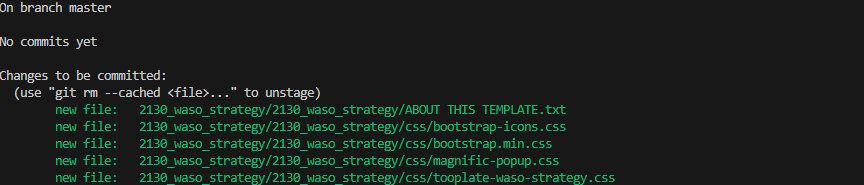
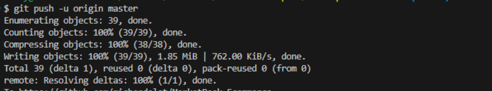

# CAPSTONE PROJECT: INTRODUCTION TO CLOUD COMPUTING

#### I created a directory named "Marketpeak_Ecommerce" 

#### I Changed directory [cd] into the newly created directory and initiate a Git repository by running the command "cd MarketPeak_Ecommerce, git init"

#### I downloaded a website template, extracted it and added it into my "Marketpeak_Ecommerce" directory

#### I staged the extracted website template into my git respository by running the command "git add 2130_waso_strategy "

#### I checked if the staged changes was successful by `git status`

#### I set my git global configuration with my username and email

#### I committed the staged changes by running the command "git commit -m "Initial commit with basic e-commerce site structure"

#### I created a git repository without any initialization and pushed my local respository content into it

#### Within my project directory, I added my remote repository url to my local repository configuration

#### I uploaded my local repository content into github

#### I set up an Ec2 account with Amazon Linux AMI

#### I connected to the instance using SSH 

#### I proceded to authenticating my github by cloning the repository with ssh

#### I generated SSH keypair using "ssh-keygen"

#### After generating the keypair i displayed and copied the public key

#### I added the SSHkey to my github

#### I cloned the repository using the SSH url by running the command " git clone git@github.com:richardolat/Marketpeak_Ecommerce.git"

#### I installed a web-server on my Ec2 by running the commands; "sudo yum update"

#### I installed Apache2 by running the command "sudo yem install httpd -y"

#### I started the httpd and enabled it by running the commands; "sudo systemctl start httpd"  "sudo systemctl enable httpd"

#### I moved to configure httpd for website by clearing the default httpd web directory. i did that by running the command "sudo rm -rf /var/www/html/*"

#### I then copied the Marketpeak Ecomerce into it by running the command  "sudo cp -r ~/Marketpeak_Ecommerce/* /var/www/html/"

#### I applied the changes by reloading the httpd server by running the command "sudo systemctl reload httpd"

#### I opened my web browser and access the IP of my EC2 to view the deployed website

## CONTINOUS INTEGRATION AND DEVELOPMENT WORKFLOW

#### i continued my development work by creating a new branch 

#### I staged my changes by running the command "git add 2130_waso_strategy" 

#### I commit my change in the git repository by running the command " git commit -m "Add new features or fix bugs"

#### I uploaded the development branch with the new changes on github by running the command "git push origin development

#### On my github, i created a pull request and merged the development branch with the main branch  

#### I reviewed the changes for any potential issue 

#### I created a pull request to merge the development branch into the main branch

#### I swicthed to the main branch by running the command "git checkout main"

#### I merged the pull request into the main branch by running the command "git merge development"

#### I pushed the merged changes to github by running the command "git push origin main"

#### I navigated to the production server where the production website is hosted and pull the latest changes from the main branch by running the command "git pull origin main"
)

